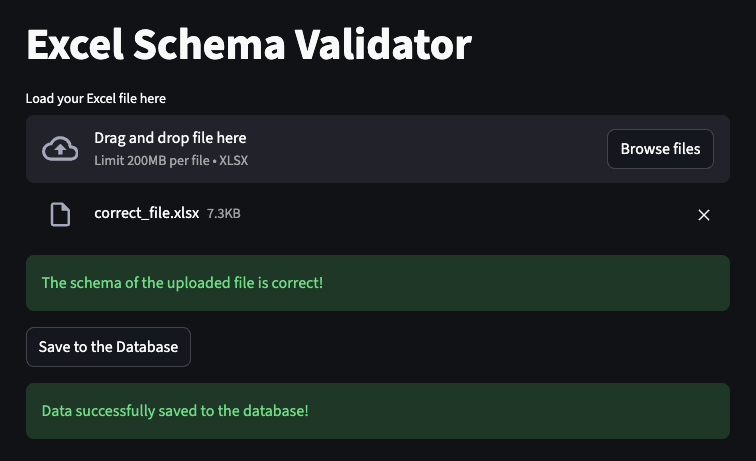
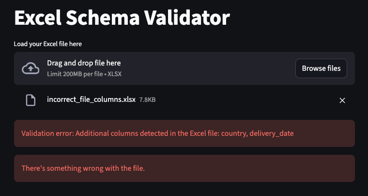
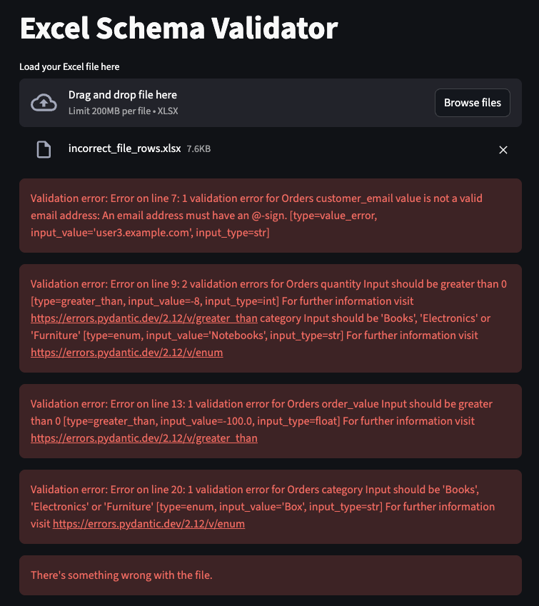

# Pydantic and Streamlit Project
The goal of this simple project was to get a first look at PyDantic and to create tests to validate the upload of an Excel file to a PostgreSQL database via Streamlit.

Building on what I learned from this other project [here](https://github.com/doegemon/data_project_standard_kit?tab=readme-ov-file), I set up a CI pipeline that ensures changes to the project are only made if all the tests created run successfully.

As simple as it may seem, many companies upload Excel or CSV files to databases to facilitate analysis or supplement existing data, and this project’s solution ensures that the file will be uploaded if it meets certain conditions (number of columns and column data types).

## Project Stages
1. Create a Streamlit page that allows users to upload a Excel file to a database (`frontend.py`);
2. Create a PostgreSQL database to store this file (hosted on [Render](https://render.com/));
3. Establish the connection between the Streamlit application and the database (`backend.py`);
4. Define the data contract (via Pydantic) that will be used to validate the file to be uploaded (`data_contract.py`);
5. Creation of tests to test the data contract validation, operation of the Streamlit application, and connection to the database (`tests/`);
6. Creation of a CI pipeline to ensure that the main branch is only updated if the code in the PR passes all tests (`.github/ci.yml`);

## Outcome
The final result of this project is a page on [Streamlit](https://exceltodbvalidation.streamlit.app/) where users can upload an Excel file directly to the PostgreSQL database hosted on Render.

If the file has the expected number of columns and the column data types are correct, this is the result:

If the file has a different number of columns, this is the result:

And if the file contains any columns with a data type different from what is defined in the data contract, this is the result:

## Conclusion
With this relatively simple solution, users can save a file directly to the database, ensuring the quality of the data in that file and maintaining the integrity of the database.

This is only possible because, on the backend, we have Pydantic checking the data types of the columns, as well as tests to: verify that the file has the correct number of columns, that the database is available, and that the Streamlit application is functioning as expected.

The Streamlit application makes this process much more user-friendly and straightforward.

## References

The initial idea of this project is part of the "Data Project and Process from Zero" from [Jornada de Dados](https://suajornadadedados.com.br/).

The repository used as reference for this project can be found [here](https://github.com/lvgalvao/workshop-01-ao-vivo).
